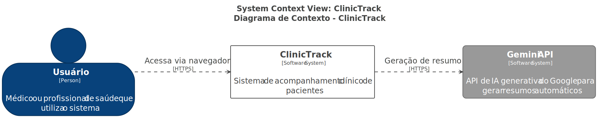
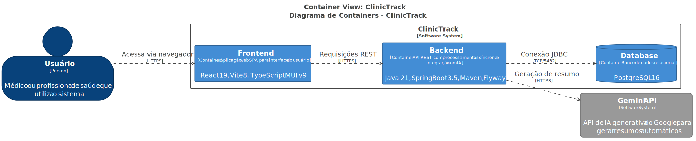
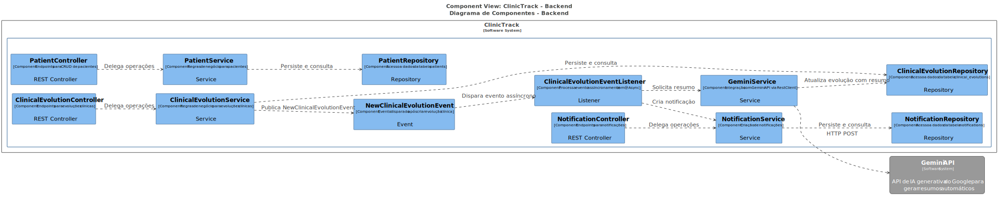
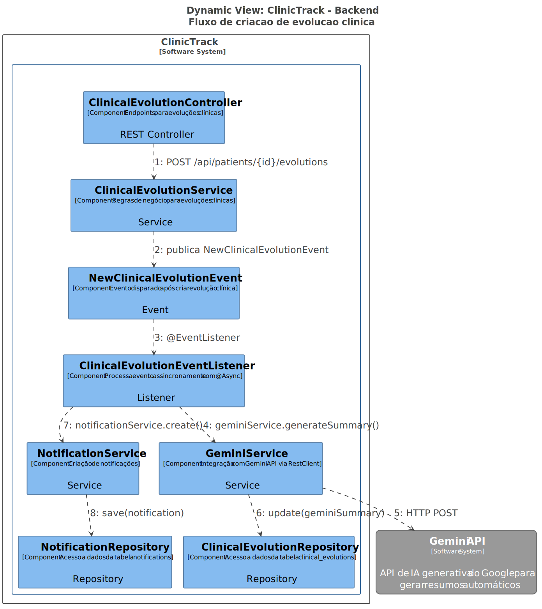

# ClinicTrack

Sistema fullstack para acompanhamento clínico de pacientes com processamento assíncrono e integração com IA.

**Links da aplicação:**
- **Frontend**: [https://clinic-track-kelvin-dev.vercel.app](https://clinic-track-kelvin-dev.vercel.app)
- **Backend**: [https://clinic-track-production.up.railway.app](https://clinic-track-production.up.railway.app)
- **Swagger UI**: [https://clinic-track-production.up.railway.app/swagger-ui.html](https://clinic-track-production.up.railway.app/swagger-ui.html)
- **Repositório**: [https://github.com/iKelvinDev/clinic-track](https://github.com/iKelvinDev/clinic-track)

---

## Funcionalidades

- CRUD de pacientes (cadastro, listagem, edição, exclusão)
- Registro de evoluções clínicas
- Histórico clínico com paginação
- Resumo de evoluções gerado por IA (Gemini API)
- Notificações assíncronas ao registrar nova evolução
- API REST com paginação e documentação Swagger

---

## Tecnologias

| Camada | Tecnologia |
|---|---|
| Backend | Java 21, Spring Boot 3.5.14, Maven, Flyway |
| Frontend | React 19, TypeScript, Vite 8, MUI v9 |
| Banco de dados | PostgreSQL 16 |
| Comunicação assíncrona | Spring Events + @Async |
| LLM | Google Gemini 3.5-flash |
| Infraestrutura | Docker Compose, Railway, Vercel |

---

## Pré-requisitos

- Java 21
- Node.js 20+
- Docker & Docker Compose
- Maven (ou utilizar `mvnw.cmd` incluso no projeto)

---

## Execução local

### 1. Clone e configure o ambiente

```bash
git clone https://github.com/iKelvinDev/clinic-track.git
cd clinic-track
cp .env.example .env
```

Edite o arquivo `.env` com suas credenciais:

```
GEMINI_API_KEY=sua_chave_gemini
POSTGRES_DB=clinic_track
POSTGRES_USER=clinic_track
POSTGRES_PASSWORD=clinic_track
```

### 2. Inicie o PostgreSQL

```bash
docker compose up -d
```

### 3. Inicie o backend

```bash
cd backend
./mvnw.cmd spring-boot:run
```

O backend será iniciado em `http://localhost:8080`.

### 4. Inicie o frontend

```bash
cd frontend
npm install
npm run dev
```

O frontend será iniciado em `http://localhost:5173`.

---

## Endpoints da API

| Método | Endpoint | Descrição |
|---|---|---|
| GET | `/api/patients?page=0&size=10` | Listar pacientes (paginado) |
| POST | `/api/patients` | Cadastrar paciente |
| GET | `/api/patients/{id}` | Buscar paciente por ID |
| PUT | `/api/patients/{id}` | Atualizar paciente |
| DELETE | `/api/patients/{id}` | Excluir paciente |
| GET | `/api/patients/{id}/evolutions?page=0&size=10` | Listar evoluções clínicas (paginado) |
| POST | `/api/patients/{id}/evolutions` | Cadastrar evolução clínica |
| GET | `/api/notifications?page=0&size=10` | Listar notificações (paginado) |

Documentação completa disponível no [Swagger UI](https://clinic-track-production.up.railway.app/swagger-ui.html).

---

## Arquitetura

Arquitetura documentada utilizando o **Modelo C4**.

Os diagramas foram gerados a partir do arquivo Structurizr DSL em `docs/diagrams/clinic-track.dsl`.

### Diagrama de Contexto (C4 - Nível 1)



### Diagrama de Containers (C4 - Nível 2)



### Diagrama de Componentes - Backend (C4 - Nível 3)



### Diagrama Dinâmico - Fluxo de Evolução



### Visão geral

A aplicação é composta por três contêineres principais:

- **Frontend** - aplicação React com Vite e MUI, deploy no Vercel
- **Backend** - API REST Spring Boot, deploy no Railway
- **Banco de dados** - PostgreSQL 16, deploy no Railway

O backend integra-se com a **API Gemini** do Google para geração automática de resumos de evoluções clínicas.

### Fluxo de dados

1. O usuário interage com o frontend (React/MUI)
2. O frontend faz requisições HTTP para a API REST do backend
3. O backend processa a requisição, persiste os dados no PostgreSQL
4. Ao criar uma evolução clínica, um evento assíncrono é disparado
5. O evento aciona a geração de resumo via Gemini API e a criação de notificação
6. A resposta da API é imediata - o processamento assíncrono ocorre em segundo plano

---

## Padrão arquitetural: Event-Driven

**Padrão utilizado**: Event-Driven com Spring Events (`ApplicationEvent` + `@EventListener` + `@Async`)

### Onde foi aplicado

1. **`NewClinicalEvolutionEvent`** - classe de evento que carrega os dados da evolução
2. **`ClinicalEvolutionEventListener`** - listener assíncrono que executa duas ações:
   - Chama a API Gemini para gerar um resumo clínico
   - Cria um registro de notificação no banco de dados

### Como funciona

```
POST /api/patients/{id}/evolutions
        │
        ▼
  ClinicalEvolutionService.create()
        │
        ├── Salva evolução no banco
        ├── Retorna resposta ao cliente (imediato)
        └── Publica NewClinicalEvolutionEvent
                    │
                    ▼
    ClinicalEvolutionEventListener (@Async)
                    │
            ┌───────┴───────┐
            ▼               ▼
    GeminiService      NotificationService
    (gerar resumo)     (criar notificação)
            │               │
            └───────┬───────┘
                    ▼
          Atualiza evolução com
          resumo do Gemini no banco
```

### Justificativa da escolha

- **Desacoplamento** - a criação da evolução é independente das ações subsequentes (notificação e resumo IA)
- **Responsividade** - a API responde imediatamente sem aguardar chamadas externas
- **Resiliência** - falhas na API Gemini não afetam o registro da evolução
- **Simplicidade** - Spring Events não requerem infraestrutura externa

---

## Decisões técnicas

| Decisão | Escolhido | Motivo |
|---|---|---|
| Carregamento de config | `spring.config.import` | Nativo do Spring Boot 3.x, zero código, `optional:` lida com arquivo ausente |
| Comunicação assíncrona | Spring Events | Sem infraestrutura extra, suficiente para a escala da aplicação |
| Biblioteca UI | MUI v9 | Componentes prontos, excelente integração com React |
| Deploy | Railway (backend), Vercel (frontend) | Gratuito, deploy automático via Git, Postgres fácil |
| Migrações de banco | Flyway | Versionado, repetível, independente de ambiente |
| Cliente HTTP | RestClient | API fluente moderna do Spring 3.x, síncrona por padrão |
| Ambiente local | Docker Compose | Ambiente consistente, mesma versão do PostgreSQL da produção |

---

## Diferenciais implementados

### Integração com Gemini API

Os resumos de evoluções clínicas são gerados automaticamente pela API Google Gemini 3.5-flash. Quando uma nova evolução é registrada, o `ClinicalEvolutionEventListener` envia a descrição para o Gemini de forma assíncrona e armazena o resumo gerado junto com a evolução.

### Processamento assíncrono com Event-Driven

Utilizando Spring Events com `@Async`, a aplicação processa notificações e resumos de IA sem bloquear a thread principal da requisição, garantindo respostas rápidas da API.

---

## Melhorias futuras

- Autenticação e autorização (Spring Security + JWT)
- Notificações em tempo real via WebSocket
- Testes automatizados (unitários, integração, e2e)
- Pipeline CI/CD com GitHub Actions
- Busca e filtros para pacientes e evoluções
- Controle de acesso baseado em papéis
- Exportação de dados do paciente (PDF, CSV)
- Melhorias na validação de entrada e sanitização